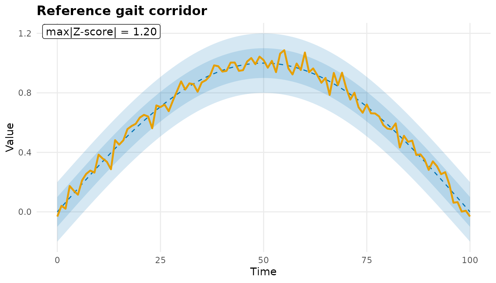
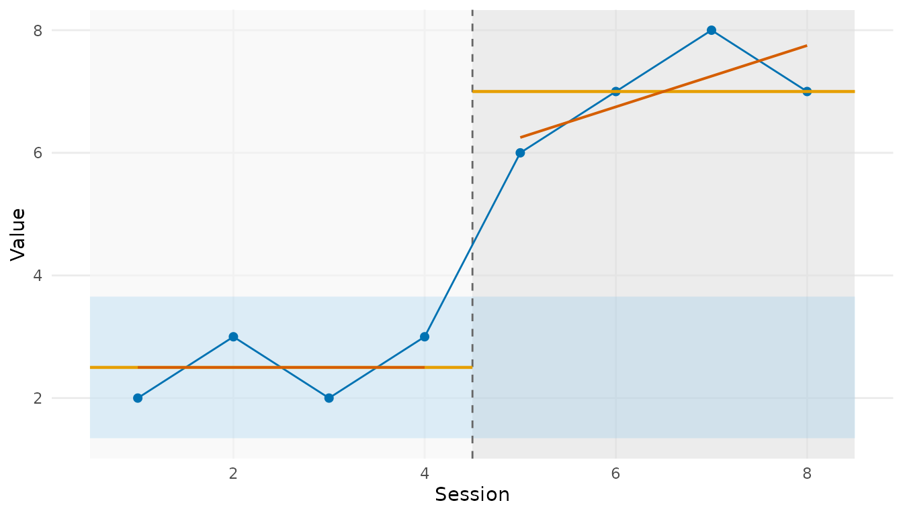

# Building blocks of a clinical outcome report

PhysioReport assembles parameterized, bilingual, colorblind-safe
clinical reports (gait, HRV, EMG) with normative overlays and change
annotated against measurement-error thresholds. This vignette walks the
reusable building blocks that a full report is made of. Everything here
runs offline on the package’s hard dependencies (`PhysioExperiment` and
`ggplot2`).

``` r

library(PhysioReport)
```

## Normative reference and z-scores

A `NormativeModel` describes the expected mean/SD of a measurement – as
a scalar, a per-timepoint waveform corridor, a stratified table, or a
lookup function.
[`normativeZScore()`](https://x-biosignal.github.io/PhysioReport/reference/normativeZScore.md)
standardizes an observation against it.

``` r

speed_norm <- NormativeModel(mean = 1.30, sd = 0.15, source = "Bohannon 1997")
speed_norm
#> <NormativeModel>
#>   kind:  scalar
#>   mean = 1.3, sd = 0.15
#>   source: Bohannon 1997
normativeZScore(c(0.90, 1.30, 1.55), speed_norm)
#> [1] -2.666667  0.000000  1.666667
```

[`plotNormativeBand()`](https://x-biosignal.github.io/PhysioReport/reference/plotNormativeBand.md)
draws the graded +/-1 SD and +/-2 SD corridor and overlays an observed
trajectory – here a knee-flexion gait-cycle waveform:

``` r

knee_norm <- NormativeModel(
  mean = sin(seq(0, pi, length.out = 101)),
  sd   = rep(0.1, 101),
  time = 0:100,
  source = "Reference gait corridor"
)
set.seed(1)
observed <- sin(seq(0, pi, length.out = 101)) + rnorm(101, 0, 0.05)
plotNormativeBand(observed, knee_norm)
#> Warning: replacing previous import 'S4Arrays::makeNindexFromArrayViewport' by
#> 'DelayedArray::makeNindexFromArrayViewport' when loading 'SummarizedExperiment'
```



## Change against MDC and MCID

[`annotateChange()`](https://x-biosignal.github.io/PhysioReport/reference/annotateChange.md)
classifies each pre-to-post change as *no change*, *detectable* (clears
the Minimal Detectable Change), or *clinically meaningful* (clears the
Minimal Clinically Important Difference), tracking benefit direction so
that decrease-is-good metrics (pain, timed tests) are handled correctly.

``` r

chg <- annotateChange(
  pre       = c(fma = 20, pain = 7),
  post      = c(fma = 31, pain = 4),
  mdc       = c(5.2, 1.0),
  mcid      = c(9, 2),
  direction = c("increase", "decrease")
)
chg[, c("metric", "change", "classification")]
#> <change_annotation> 2 metric(s)
#>  metric change                classification
#>     fma     11 clinically meaningful (>MCID)
#>    pain     -3 clinically meaningful (>MCID)
```

## Single-case designs

For n-of-1 / single-case experimental designs,
[`plotSCED()`](https://x-biosignal.github.io/PhysioReport/reference/plotSCED.md)
draws the SCED-standard overlays (phase shading, per-phase means, the
baseline +/-2 SD band, and split-middle celeration lines):

``` r

plotSCED(c(2, 3, 2, 3, 6, 7, 8, 7), rep(c("A", "B"), each = 4))
```



(The effect-size summary
[`scedStats()`](https://x-biosignal.github.io/PhysioReport/reference/scedStats.md)
delegates to the peer-reviewed estimators in the optional
`PhysioClinStats` package.)

## Bilingual labels

Every axis label and caption flows through
[`physioLabel()`](https://x-biosignal.github.io/PhysioReport/reference/physioLabel.md),
so the same report renders in English or Japanese:

``` r

c(en = physioLabel("session", "en"), ja = physioLabel("session", "ja"))
#>           en           ja 
#>    "Session" "セッション"
```

## Where to go next

- [`?NormativeModel`](https://x-biosignal.github.io/PhysioReport/reference/NormativeModel.md)
  /
  [`?plotNormativeBand`](https://x-biosignal.github.io/PhysioReport/reference/plotNormativeBand.md)
  – normative corridors.
- [`?annotateChange`](https://x-biosignal.github.io/PhysioReport/reference/annotateChange.md)
  /
  [`?plotChangeAnnotated`](https://x-biosignal.github.io/PhysioReport/reference/plotChangeAnnotated.md)
  – MDC/MCID change.
- [`?clinicalGaitReport`](https://x-biosignal.github.io/PhysioReport/reference/clinicalGaitReport.md)
  /
  [`?renderClinicalReport`](https://x-biosignal.github.io/PhysioReport/reference/renderClinicalReport.md)
  – the full parameterized gait/HRV/EMG reports (some need optional
  ecosystem packages, e.g. `PhysioMoCap`, `officer`).
